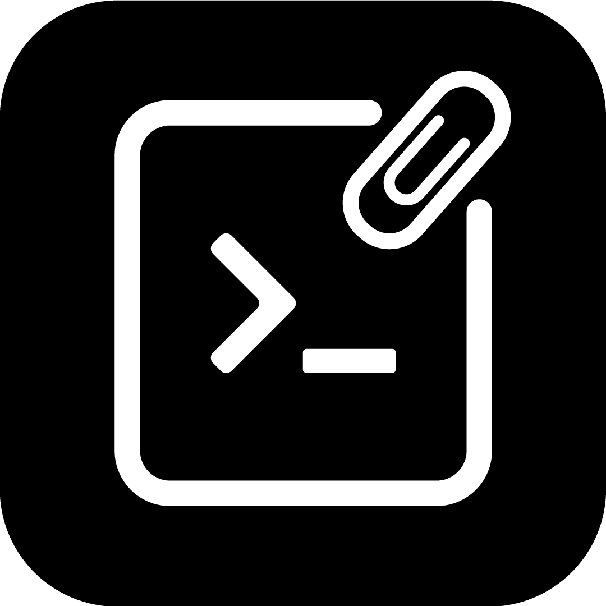

<p align="center">
  
</p>

<h1 align="center">Stash</h1>
<p align="center">Tu librería personal de prompts — rápida, local y siempre a mano.</p>

<p align="center">
  <a href="https://github.com/GonzaBena/Stash/releases/latest">
    
  </a>
  
  
</p>

---

## ¿Qué es Stash?

Stash es una app de escritorio para guardar, organizar y reutilizar tus prompts de IA. Vive en la barra del sistema y aparece al instante con **Alt + Space** gracias al Companion, una ventana tipo Spotlight que te deja buscar y copiar cualquier prompt sin interrumpir tu flujo.

## Características

- **Librería personal** — crea, edita y etiqueta tus prompts con soporte para múltiples modelos (Claude, ChatGPT, Gemini, Perplexity…).
- **Companion (Alt + Space)** — overlay flotante de búsqueda instantánea; navega con ↑ ↓, copia con Enter o con clic.
- **Explorar comunidad** — descubre y guarda prompts públicos de otros usuarios.
- **Sincronización** — autenticación y sincronización en la nube vía Supabase (opcional).
- **Temas y densidades** — 4 paletas de color × 3 densidades de layout.
- **Bandeja del sistema** — se minimiza al tray; siempre disponible, nunca estorba.
- **Multi-plataforma** — Windows, macOS y Linux.

## Capturas

> *(próximamente)*

## Instalación

### Descargar el instalador

Descarga la última versión desde [Releases](https://github.com/GonzaBena/Stash/releases/latest):

| Plataforma | Archivo |
|---|---|
| Windows | `Stash-Setup-x.x.x.exe` |
| macOS | `Stash-x.x.x.dmg` |
| Linux | `Stash-x.x.x.AppImage` |

### Compilar desde el código fuente

```bash
# Requisitos: Node.js 20+, pnpm
git clone https://github.com/GonzaBena/Stash.git
cd Stash
pnpm install

# Ejecutar en modo desarrollo
pnpm start

# Compilar para tu plataforma
pnpm run build:win    # Windows → dist/*.exe
pnpm run build:mac    # macOS   → dist/*.dmg
pnpm run build:linux  # Linux   → dist/*.AppImage
```

## Uso rápido

| Acción | Atajo |
|---|---|
| Abrir / cerrar Companion | **Alt + Space** |
| Navegar la lista | **↑ / ↓** |
| Copiar prompt seleccionado | **Enter** |
| Cerrar Companion | **Esc** |

## Stack técnico

| Capa | Tecnología |
|---|---|
| Shell de escritorio | Electron 30 |
| UI | React 18 (CDN + Babel standalone) |
| Base de datos / Auth | Supabase |
| Build | electron-builder 25 |
| Package manager | pnpm |

## Contribuir

1. Forkea el repo y crea una rama: `git checkout -b feat/mi-feature`
2. Haz tus cambios y commitea: `git commit -m "feat: descripción"`
3. Abre un Pull Request describiendo el problema que resuelve.

## Licencia

MIT © [GonzaBena](https://github.com/GonzaBena)
